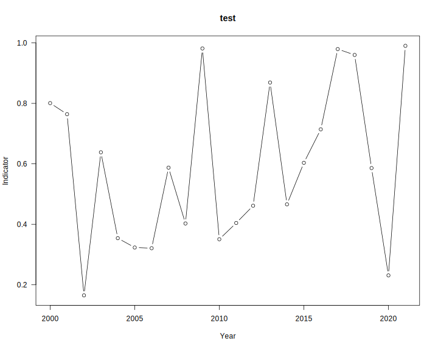

# Finnish Biodiversity Indicators API

An API for biodiversity indicators from Finland

## Requirements

* `git`
* `docker`
* `docker-compose`

## Install
```{bash}
git clone https://github.com/luomus/fin-biodiv-indicators.git
```

## Run
To run on [http://api.localhost](http://api.localhost) 
```{bash}
cd fin-biodiv-indicators
FINBIF_ACCESS_TOKEN=<token> HOST=localhost PGUSER=<user> PGPASSWORD=<password> docker-compose up --build -d
```

## Usage
### JSON
[http://api.localhost/sp-index/json?sp=skylark&year=1985:1988](http://api.localhost/sp-index/json?sp=skylark&year=1985:1988)
```{javascript}
[
  {
    "year": 1985,
    "index": 0.7096,
    "sd": 0.0771
  },
  {
    "year": 1986,
    "index": 0.841,
    "sd": 0.078
  },
  {
    "year": 1987,
    "index": 0.829,
    "sd": 0.0773
  },
  {
    "year": 1988,
    "index": 0.9182,
    "sd": 0.084
  }
]
```

### CSV
[http://api.localhost/sp-index/csv?sp=skylark&year=1985:1988](http://api.localhost/sp-index/csv?sp=skylark&year=1985:1988)

### Graphics
[http://api.localhost/sp-plot?sp=skylark](http://api.localhost/sp-plot?sp=skylark)


