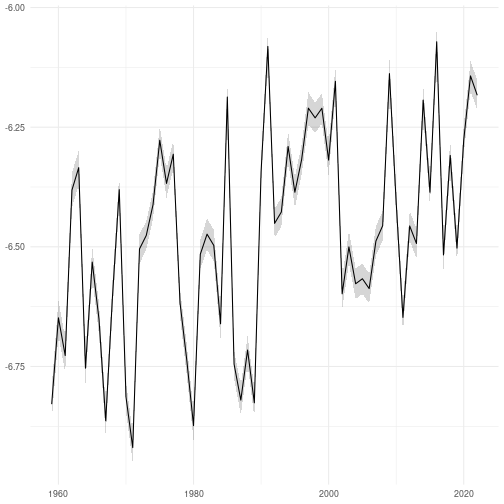

This documents outlines how a multi-taxon indicator (Community temperature index
for Finnish Birds in Winter) can be calculated in R.

## Load packages

The following packages are required. All packages are available on
[CRAN](https://cran.r-project.org/) apart from `{fbi}` which can be installed
from GitHub.


```r
library(dplyr)
library(fbi)
library(finbif)
library(ggplot2)
library(lubridate)
library(lme4)
library(arm)
```

## Survey data

These five fields are required for the survey data.


```r
select <- c("document_id", "location_id", "year", "month", "day")
```

These filters restrict the survey data to the Dec-Jan "Winter Bird Census"
monitoring dataset from December 1958 onwards where the selected data fields
have no missing data.


```r
filter <- list(
  collection = "Winter Bird Census",
  date_range_ymd = c("1958-12-01", ""),
  date_range_md= c("12-01", "01-31"),
  has_value = select
)
```

The survey data can now downloaded from FinBIF.


```r
surveys <- finbif_occurrence(
  filter = filter,
  select = select,
  aggregate = "events",
  aggregate_counts = FALSE,
  n = "all",
  quiet = TRUE
)
```

A single processing function is applied to the survey data to limit each site
to the first survey of the year (where year is the period Dec-Jan).


```r
surveys <- pick_first_survey_in_winter(surveys)
```

## Count data

Count data requires two fields to be selected: the survey identifier
(`document_id`) and the measure of abundance (`abundance_interpreted`).


```r
select <- c("document_id", abundance = "abundance_interpreted")
```

The count data requires the same filters as the survey data (though the filter
`has_value` needs to be redefined).


```r
filter[["has_value"]] <- select
```

A set of taxa and their species temperature index values is defined.


```r
sti <- c(
  "Poecile montanus" = -7.51,
  "Regulus regulus" = -4.23,
  "Lophophanes cristatus" = -5.90,
  "Certhia familiaris" = -6.89
)
```

The count data for these taxa can now be downloaded from FinBIF.


```r
counts <- lapply(
  names(sti),
  finbif_occurrence,
  filter = filter,
  select = select,
  n = "all",
  quiet = TRUE
)
```

The count data is then combined with the survey data and the species temperature
indices.


```r
counts <- lapply(counts, combine_with_surveys, surveys)

counts <- mapply(mutate, counts, sp = names(sti), SIMPLIFY = FALSE)

counts <- do.call(rbind, counts)

counts[["sti"]] <- sti[counts[["sp"]]]
```

# Create Index

A community temperature index for each year is created by fitting a linear mixed
effects regression model to the combined data.


```r
cti_data <- summarise(
  group_by(counts, location_id, year),
  cti = sum(abundance * sti) / sum(abundance), .groups = "drop"
)

cti <- lmer(cti ~ (1 | location_id) + (1 | year), cti_data)

cti <- data.frame(index = coef(cti)[["year"]], se = se.coef(cti)[["year"]])

cti[["time"]] <- as.integer(row.names(cti))

names(cti) <- c("index", "se", "time")
```


```r
ggplot(cti) +
aes(
  x = parse_date_time(time, "Y"),
  y = index,
  ymin = index - se,
  ymax = index + se
) +
geom_ribbon(alpha = .2) +
geom_line() +
ylab(NULL) +
xlab(NULL) +
theme_minimal()
```


