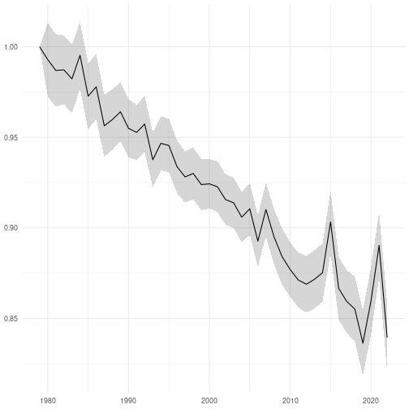

```r
library(dplyr, quietly = TRUE)
library(fbi, quietly = TRUE)
library(finbif, quietly = TRUE)
library(ggplot2, quietly = TRUE)
library(lubridate, quietly = TRUE)
library(rtrim, quietly = TRUE)
```


```r
select <- c("document_id", "location_id", "year", "month", "day")
```


```r
filter <- list(
  location_tag = "farmland",
  collection = c(
    "Point counts of breeding terrestrial birds",
    "Line transect censuses of breeding birds"
  ),
  date_range_ymd = c("1979-01-01", ""),
  has_value = select
)
```


```r
surveys <- finbif_occurrence(
  filter = filter,
  select = select,
  aggregate = "events",
  aggregate_counts = FALSE,
  n = "all",
  quiet = TRUE
)
```


```r
surveys <- pick_first_survey_in_year(surveys)

surveys <- require_two_years(surveys)
```


```r
filter[["has_value"]] <- c("document_id", "abundance_interpreted")
```


```r
taxa <- c(
  "Vanellus vanellus", "Numenius arquata", "Alauda arvensis", "Hirundo rustica",
  "Delichon urbicum", "Anthus pratensis", "Saxicola rubetra", "Turdus pilaris",
  "Sylvia communis", "Corvus monedula", "Sturnus vulgaris"
)
```


```r
counts <- lapply(
  taxa,
  finbif_occurrence,
  filter = filter,
  select = c("scientific_name", "document_id", abundance = "pair_abundance"),
  n = "all",
  quiet = TRUE
)
```


```r
counts <- lapply(counts, zero_fill, surveys)

counts <- lapply(counts, sum_by_event)

counts <- lapply(counts, remove_all_zero_locations)
```


```r
model <- lapply(
  counts, trim, count_col ="abundance", site_col = "location_id",
  year_col = "year"
)
```


```r
indices <- lapply(model, index, base = 2000)

indices <- mapply(mutate, indices, sp = taxa, SIMPLIFY = FALSE)

indices <- do.call(rbind, indices)
```


```r
n <- 1000
max_cv <- 3
imputed_min <- .01
truncfac <- 10
base <- 1
nyrs <- 44

indices <- mutate(
  indices, cv = ifelse(imputed >= .1 & se_imp > 0, se_imp / imputed, NA_real_)
)

indices <- group_by(indices, sp)

indices <- mutate(indices, cv = mean(cv, na.rm = TRUE))

indices <- filter(indices, cv < max_cv)

indices <- mutate(indices, imputed = pmax(imputed, imputed_min))

indices <- mutate(indices, se_imp = if_else(imputed > imputed_min, se_imp, 0))

indices <- mutate(indices, se_imp = se_imp / imputed)

indices <- mutate(indices, imputed = log(imputed))

indices <- group_by(indices, time, sp)

indices <- summarise(
  indices, mc = rnorm(n, imputed, se_imp), i = seq(n), .groups = "keep"
)

indices <- mutate(indices, mc = pmax(mc, log(imputed_min)))

indices <- group_by(indices, sp, i)

indices <- arrange(indices, time)

indices <- mutate(
  indices, mcf = pmax(pmin(lead(mc) - mc, log(truncfac)), log(1 / truncfac))
)

indices <- arrange(indices, -time)

indices <- mutate(
  indices, mcb = pmax(pmin(lead(mc) - mc, log(truncfac)), log(1 / truncfac))
)

indices <- group_by(indices, i, time)

index <- summarise(
  indices,
  mcf = mean(mcf, na.rm = TRUE), mcb = mean(mcb, na.rm = TRUE),
  .groups = "drop_last"
)

index <- arrange(index, time)

index <- mutate(index, mcf = cumsum(lag(lead(mcf, base - 1), base, 0)))

index <- arrange(index, -time)

index <- mutate(
  index, mcb = cumsum(lag(lead(mcb, nyrs - base), nyrs - base + 1, 0))
)

index <- group_by(index, time)

index <- summarise(
  index,
  index = exp(mean(mcf)) * exp(mean(mcb)),
  se = sd(mcf) * exp(mean(mcf)) + sd(mcb) * exp(mean(mcb))
)
```


```r
ggplot(index) +
aes(
  x = parse_date_time(time, "Y"),
  y = index,
  ymin = index - se,
  ymax = index + se
) +
geom_ribbon(alpha = .2) +
geom_line() +
ylab(NULL) +
xlab(NULL) +
theme_minimal()
```


