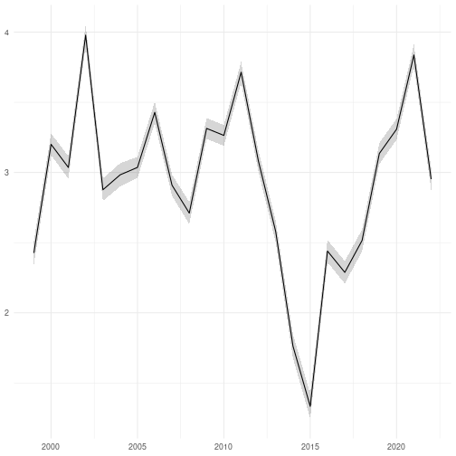

This documents outlines how a multi-taxon indicator (Farmland Butterfly
Abundance) can be calculated in R.

## Load packages

The following packages are required. All packages are available on
[CRAN](https://cran.r-project.org/) apart from `{fbi}` which can be installed
from GitHub.


```r
library(dplyr)
library(fbi)
library(finbif)
library(ggplot2)
library(lubridate)
library(lme4)
library(arm)
```

## Survey data

These five fields are required for the survey data.


```r
select <- c("document_id", "location_id", "year", "month", "day")
```

These filters restrict the survey data to the "Butterflies in Finnish
agricultural landscapes" dataset with the selected data fields have no missing
data.


```r
filter <- list(
  collection = "Butterflies in Finnish agricultural landscapes",
  has_value = select
)
```

The survey data can now downloaded from FinBIF.


```r
surveys <- finbif_occurrence(
  filter = filter,
  select = select,
  aggregate = "events",
  aggregate_counts = FALSE,
  n = "all",
  quiet = TRUE
)
```

Two processing functions are applied to the survey data to first limit the
surveys to sites where at least seven fortnights have been surveyed and limit
each site's surveys to the first survey in each fortnight.


```r
surveys <- require_seven_fortnights(surveys)

surveys <- pick_first_survey_in_fortnight(surveys)
```

## Count data

Count data requires three fields to be selected: the survey identifier
(`document_id`) the survey site section (`section`) and the measure of abundance
(`abundance_interpreted`).


```r
select <- c("document_id", "section", abundance = "abundance_interpreted")
```

The count data requires the same filters as the survey data (though the filter
`has_value` needs to be redefined).


```r
filter[["has_value"]] <- select
```

A set of taxa contributing to the total abundance is selected.


```r
taxa <- c(
  "Aglais urticae",
  "Boloria euphrosyne",
  "Lycaena virgaureae",
  "Polygonia c-album"
)
```

The count data for these taxa can now be downloaded from FinBIF.


```r
counts <- lapply(
  taxa,
  finbif_occurrence,
  filter = filter,
  select = select,
  n = "all",
  quiet = TRUE
)
```

Three processing functions are applied to the count data to: sum the counts
over the survey site sections; combine the count and survey data together; amd
sum over the counts for each site-year combination.


```r
counts <- lapply(counts, sum_over_sections)

counts <- lapply(counts, combine_with_surveys, surveys)

counts <- lapply(counts, sum_by_event)
```

The count data can then be summed across the taxa.


```r
counts <- mapply(mutate, counts, sp = taxa, SIMPLIFY = FALSE)

counts <- do.call(rbind, counts)

counts <- group_by(counts, location_id, year)

counts <- summarise(counts, abundance = sum(abundance), .groups = "drop")
```

# Create Index

A index of total abundance for each year is created by fitting a generalised
linear mixed effects regression model to the combined data.


```r
model <- glmer(
  abundance ~ (1 | location_id) + (1 | year), counts, family = "poisson"
)

index <- data.frame(
  index = coef(model)[["year"]], se = se.coef(model)[["year"]]
)

index[["time"]] <- as.integer(row.names(index))

names(index) <- c("index", "se", "time")
```


```r
ggplot(index) +
aes(
  x = parse_date_time(time, "Y"),
  y = index,
  ymin = index - se,
  ymax = index + se
) +
geom_ribbon(alpha = .2) +
geom_line() +
ylab(NULL) +
xlab(NULL) +
theme_minimal()
```


