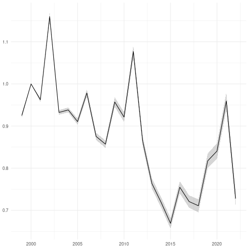

```r
library(dplyr, quietly = TRUE)
library(fbi, quietly = TRUE)
library(finbif, quietly = TRUE)
library(ggplot2, quietly = TRUE)
library(lubridate, quietly = TRUE)
library(lme4, quietly = TRUE)
library(arm, quietly = TRUE)
```


```r
select <- c("document_id", "location_id", "year", "month", "day")
```


```r
filter <- list(
  collection = "Butterflies in Finnish agricultural landscapes",
  has_value = select
)
```


```r
surveys <- finbif_occurrence(
  filter = filter,
  select = select,
  aggregate = "events",
  aggregate_counts = FALSE,
  n = "all",
  quiet = TRUE
)
```


```r
surveys <- require_seven_fortnights(surveys)

surveys <- pick_first_survey_in_fortnight(surveys)
```


```r
filter[["has_value"]] <- c("document_id", "section", "abundance_interpreted")
```


```r
taxa <- c(
  "Aglais urticae",
  "Boloria euphrosyne",
  "Lycaena virgaureae",
  "Polygonia c-album"
)
```


```r
counts <- lapply(
  taxa,
  finbif_occurrence,
  filter = filter,
  select = c("scientific_name", "document_id", "section", "abundance"),
  n = "all",
  quiet = TRUE
)
```


```r
counts <- lapply(counts, sum_over_sections)

counts <- lapply(counts, combine_with_surveys, surveys)

counts <- lapply(counts, sum_by_event)

counts <- do.call(rbind, counts)

counts <- group_by(counts, location_id, year)

counts <- summarise(counts, abundance = sum(abundance), .groups = "drop")
```


```r
model <- glmer(
  abundance ~ (1 | location_id) + (1 | year), counts, family = "poisson"
)
```


```r
index <- data.frame(
  index = coef(model)[["year"]], se = se.coef(model)[["year"]]
)

index[["time"]] <- as.integer(row.names(index))

names(index) <- c("index", "se", "time")
```


```r
ggplot(index) +
aes(
  x = parse_date_time(time, "Y"),
  y = index,
  ymin = index - se,
  ymax = index + se
) +
geom_ribbon(alpha = .2) +
geom_line() +
ylab(NULL) +
xlab(NULL) +
theme_minimal()
```


