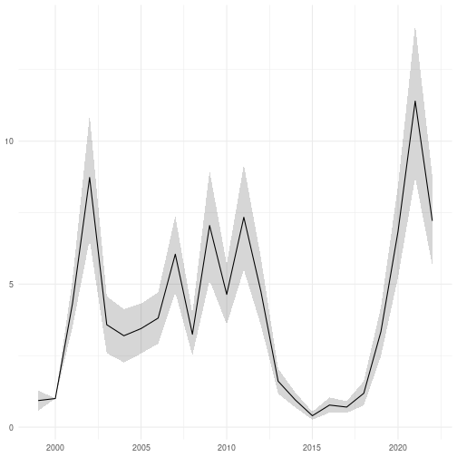

This documents outlines how a single-taxon indicator (_Aglais urticae_
on farms in Finland) can be calculated in R using the RBMS method.

## Load packages

The following packages are required. All packages are available on
[CRAN](https://cran.r-project.org/) apart from `{fbi}` and `{rbms}` which can be
installed from GitHub.


```r
library(dplyr)
library(fbi)
library(finbif)
library(ggplot2)
library(lubridate)
library(rbms)
```

## Survey data

These five fields are required for the survey data.


```r
select <- c("document_id", "location_id", "year", "month", "day")
```

These filters restrict the survey data to the "Butterflies in Finnish
agricultural landscapes" dataset with the selected data fields have no missing
data.


```r
filter <- list(
  collection = "Butterflies in Finnish agricultural landscapes",
  has_value = select
)
```

The survey data can now downloaded from FinBIF.


```r
surveys <- finbif_occurrence(
  filter = filter,
  select = select,
  aggregate = "events",
  aggregate_counts = FALSE,
  n = "all",
  quiet = TRUE
)
```


A single processing function is applied to the survey data to convert the year
month and day fields into a single date field.


```r
surveys <- format_date(surveys)
```

## Count data

Count data requires three fields to be selected: the survey identifier
(`document_id`) the survey site section (`section`) and the measure of abundance
(`abundance_interpreted`).


```r
select <- c("document_id", "section", abundance = "abundance_interpreted")
```

The count data requires the same filters as the survey data (though the filter
`has_value` needs to be redefined).


```r
filter[["has_value"]] <- select
```

The count data for _Aglais urticae_ (Small tortoiseshell) can now be downloaded
from FinBIF.


```r
counts <- finbif_occurrence(
  taxa = "Aglais urticae",
  filter = filter,
  select = select ,
  n = "all",
  quiet = TRUE
)
```

Two processing functions are applied to the count data to: sum the counts
over the survey site sections; and combine the count and survey data together.


```r
counts <- sum_over_sections(counts, surveys)

counts <- combine_with_surveys(counts, surveys)
```

# Fit RBMS Model

An RBMS model is used to estimate the change in abundance over time (see 
[RBMS documentation
](https://retoschmucki.github.io/rbms/articles/Get_Started_2.html) for details)
with uncertainty estimated via bootstrapping.


```r
StartMonth <- 4
EndMonth <- 9
StartDay <- 1
EndDay <- 30
Anchor <- TRUE
AnchorLength <- 14
AnchorLag <- 14
AnchorTimeUnit <- "d"
NbrSample <- 500
MinVisit <- 5
MinOccur <- 2
MinNbrSite <- 5
MaxTrial <- 4
GamFamily <- "nb"
FlightCurveTimeUnit <- "w"
MultiVisit <- "mean"
MinFC <- 0.10
boot_n <- 200

surveys <- select(surveys, site_id = location_id, year, date)

init_year <- min(surveys[["year"]])

last_year <- max(surveys[["year"]])

nyears <- last_year - init_year + 1

ts_date <- ts_dwmy_table(InitYear = init_year, LastYear = last_year)

ts_season <- ts_monit_season(
  d_series     = ts_date,
  StartMonth   = StartMonth,
  EndMonth     = EndMonth,
  StartDay     = StartDay,
  EndDay       = EndDay,
  Anchor       = Anchor,
  AnchorLength = AnchorLength,
  AnchorLag    = AnchorLag,
  TimeUnit     = AnchorTimeUnit
)

ts_season_visit <- ts_monit_site(m_visit = surveys, ts_season = ts_season)

counts <- mutate(counts, species = 1)

counts <- select(
  counts, count = abundance, site_id = location_id, year, date, species
)

ts_season_count <- ts_monit_count_site(
  m_season_visit = ts_season_visit, m_count = counts
)

ts_flight_curve <- flight_curve(
  ts_season_count = ts_season_count,
  NbrSample       = NbrSample,
  MinVisit        = MinVisit,
  MinOccur        = MinOccur,
  MinNbrSite      = MinNbrSite,
  MaxTrial        = MaxTrial,
  GamFamily       = GamFamily,
  SpeedGam        = FALSE,
  TimeUnit        = FlightCurveTimeUnit,
  MultiVisit      = MultiVisit,
  verbose         = FALSE
)

impt_counts <- impute_count(
  ts_season_count = ts_season_count,
  ts_flight_curve = ts_flight_curve[["pheno"]],
  TimeUnit        = FlightCurveTimeUnit,
  MultiVisit      = MultiVisit
)

sindex <- site_index(butterfly_count = impt_counts, MinFC = MinFC)

bootsample <- boot_sample(data = sindex, boot_n = boot_n)

index_mc <- mapply(
  collated_index,
  bootID = seq_len(boot_n),
  MoreArgs = list(data = sindex, s_sp = 1, boot_ind = bootsample),
  SIMPLIFY = FALSE
)
```

# Create Index

An index of change in relative abundance with uncertainty derived from the
bootstrapped estimates can be created by setting the base year to the year 2000.


```r
base <- which(sort(unique(surveys[["year"]])) == 2000)

index_mc <- lapply(index_mc, getElement, "col_index")

index_mc <- do.call(rbind, index_mc)

index_mc <- mutate(index_mc, mc = log(pmax(1 / 100, COL_INDEX)), time = M_YEAR)

index_mc <- group_by(index_mc, BOOTi)

index_mc <- arrange(index_mc, time)

index_mc <- mutate(index_mc, mcf = lead(mc) - mc)

index_mc <- mutate(index_mc, mcf = lead(mcf, base - 1))

index_mc <- mutate(index_mc, mcf = lag(mcf, base, 0))

index_mc <- mutate(index_mc, mcf = cumsum(mcf))

index_mc <- arrange(index_mc, -time)

index_mc <- mutate(index_mc, mcb = lead(mc) - mc)

index_mc <- mutate(index_mc, mcb = lead(mcb, nyears - base))

index_mc <- mutate(index_mc, mcb = lag(mcb, nyears - base + 1, 0))

index_mc <- mutate(index_mc, mcb = cumsum(mcb))

index_mc <- group_by(index_mc, time)

index <- summarise(
  index_mc,
  mean = exp(mean(mcf)) * exp(mean(mcb)),
  sd = sd(mcf) * exp(mean(mcf)) + sd(mcb) * exp(mean(mcb))
)

index <- mutate(index, lower = mean - sd, upper = mean + sd)
```


```r
ggplot(index) +
aes(x = parse_date_time(time, "Y"), y = mean, ymin = lower, ymax = upper) +
geom_ribbon(alpha = .2) +
geom_line() +
ylab(NULL) +
xlab(NULL) +
theme_minimal()
```


