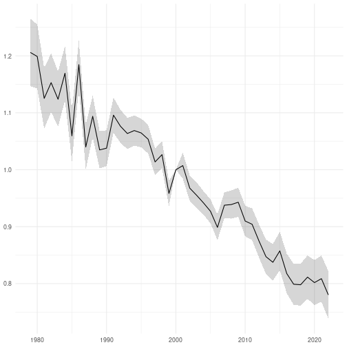

```r
library(fbi, quietly = TRUE)
library(finbif, quietly = TRUE)
library(ggplot2, quietly = TRUE)
library(lubridate, quietly = TRUE)
library(rtrim, quietly = TRUE)
```


```r
select <- c("document_id", "location_id", "year", "month", "day")
```


```r
filter <- list(
  location_tag = "farmland",
  collection = c(
    "Point counts of breeding terrestrial birds",
    "Line transect censuses of breeding birds"
  ),
  date_range_ymd = c("1979-01-01", ""),
  has_value = select
)
```


```r
surveys <- finbif_occurrence(
  filter = filter,
  select = select,
  aggregate = "events",
  aggregate_counts = FALSE,
  n = "all",
  quiet = TRUE
)
```


```r
surveys <- pick_first_survey_in_year(surveys)

surveys <- require_two_years(surveys)
```


```r
filter$has_value <- c("document_id", "abundance_interpreted")
```


```r
counts <- finbif_occurrence(
  taxa = "Anthus pratensis",
  filter = filter,
  select = c("document_id", abundance = "pair_abundance"),
  n = "all",
  quiet = TRUE
)
```


```r
counts <- zero_fill(counts, surveys)

counts <- sum_by_event(counts)

counts <- remove_all_zero_locations(counts)
```


```r
model <- trim(abundance ~ location_id + year, counts)
```


```r
index <- index(model, base = 2000)
```


```r
ggplot(index) +
aes(
  x = parse_date_time(time, "Y"),
  y = imputed,
  ymin = imputed - se_imp,
  ymax = imputed + se_imp
) +
geom_ribbon(alpha = .2) +
geom_line() +
ylab(NULL) +
xlab(NULL) +
theme_minimal()
```


